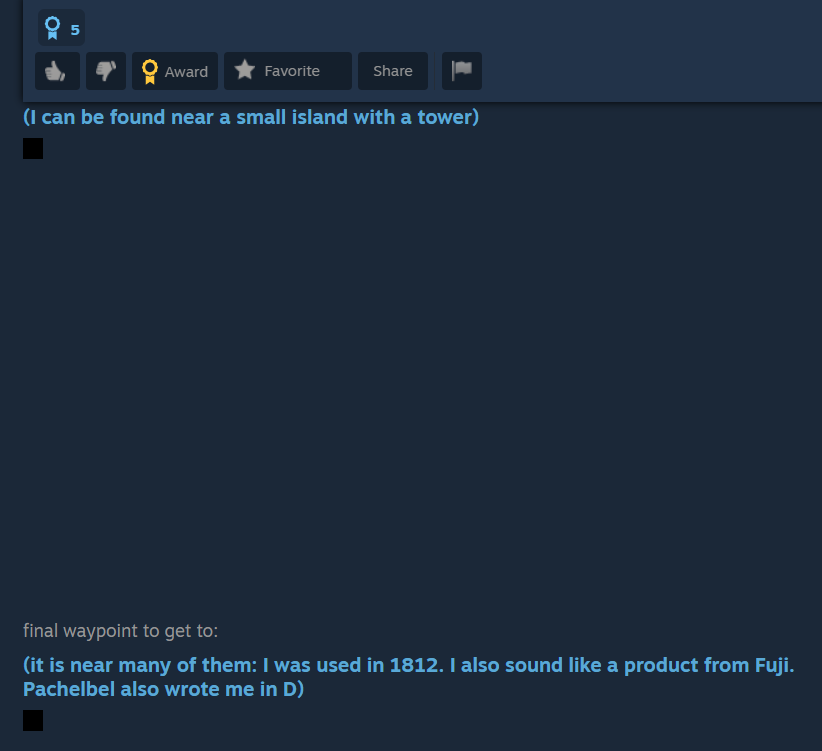
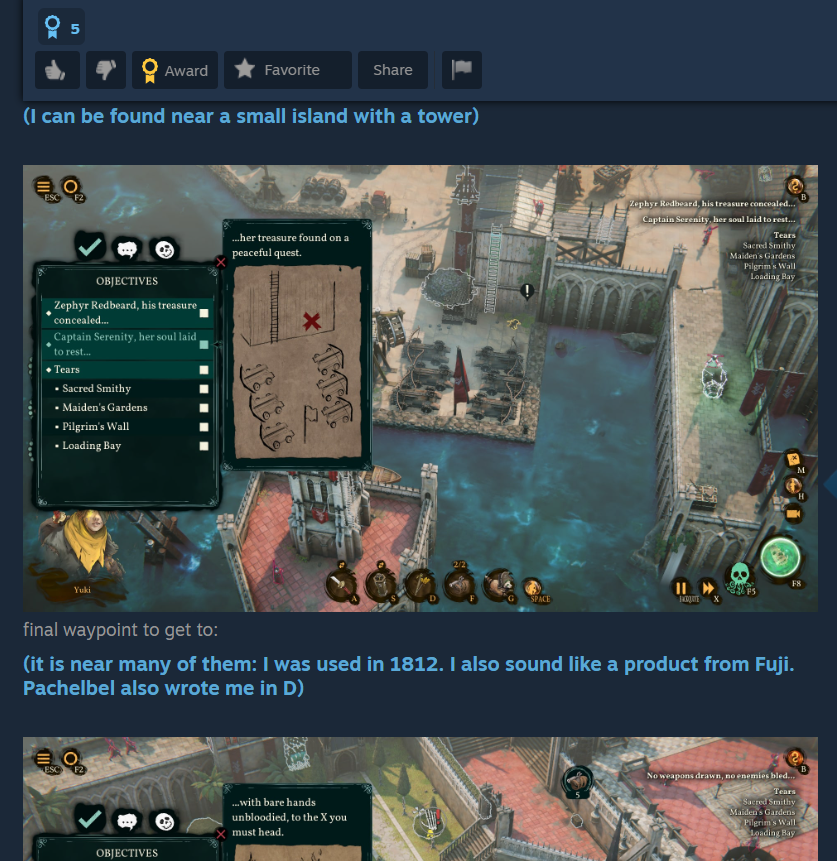

# Steam Guide Auto-Reveal Spoilers

A Tampermonkey userscript to permanently display hidden spoiler images and text in Steam Guides without needing to hover over them. Perfect for image-heavy guides where hovering over every single spoiler block becomes tedious.

## Screenshots

| Before | After |
| :---: | :---: |
|  |  |

## Features

* **No Hovering Required:** Overrides the native Steam CSS to instantly reveal text and images hidden behind `bb_spoiler` tags.
* **Instant Clarity:** Forces hidden images to be fully opaque and visible right when the page loads.
* **Lightweight:** Uses clean CSS injection rather than heavy script loops, ensuring zero impact on browser performance.

## Installation

*(Note: You must have a userscript manager like the [Tampermonkey extension](https://www.tampermonkey.net/) installed in your browser first.)*

**▶ [Click here to install the script automatically](https://raw.githubusercontent.com/YOUR-USERNAME/YOUR-REPO-NAME/main/steam-spoiler-reveal.user.js)**  
*(Make sure to replace the URL above with the actual raw link to your `.user.js` file!)*

### Manual Installation
Alternatively, you can manually copy the code from the `.user.js` file in this repository and paste it into a new script in your Tampermonkey dashboard.

---
### About
A Tampermonkey userscript to permanently show spoiler-tagged content on Steam Guides.